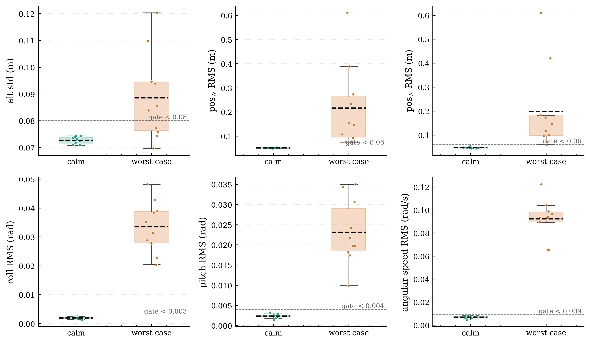
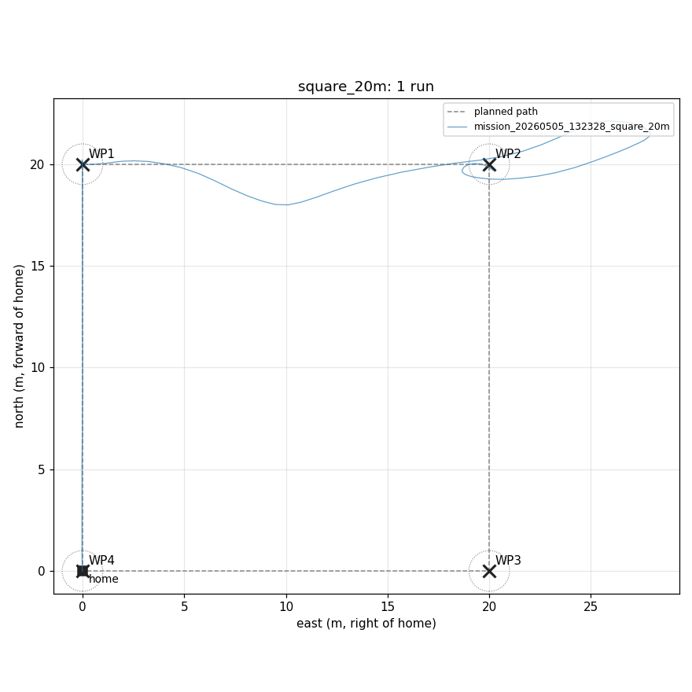
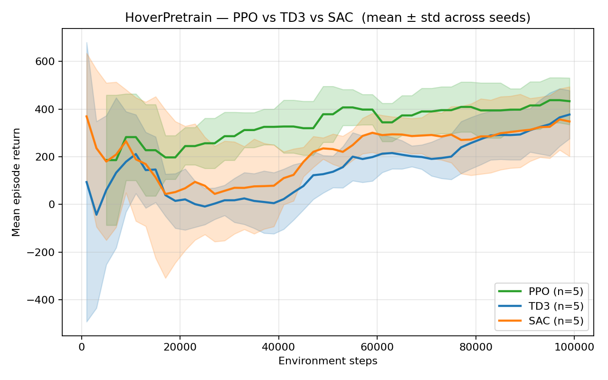

# Swarm_Drones

Bridge between Isaac Sim and ArduPilot SITL for the F450 capstone, plus the `lab/` package for stage tooling and disturbance harness.

## Layout

- `lab/` — main Python package. Holds the Isaac↔SITL bridge (`lab/bridge/Nvidia_SITL_connecter.py`), takeoff/autotune scripts (`lab/scripts/`), control + metrics, disturbance harness, mission DSL + runner, RL training stack, dynamics mirror, and tests.
- `sitl/` — ArduCopter SITL param file (`params.parm`) loaded by the WSL launch command.
- `scene/` — drone USDs and AUA world (`AUA_world_500m.usd` + `aua_bake/`). See **Heavy assets** below for the textures download.
- `swarm_optimization/` — 2D swarm coverage testbed and benchmarking experiments (see [`swarm_optimization/README.md`](swarm_optimization/README.md)).
- `docs/` — hardware reference docs shared across all sub-projects: [`f450-reference.md`](docs/f450-reference.md) (F450 specs, motor convention, flight-time data), [`battery-model.md`](docs/battery-model.md) (energy model, 3S/4S battery options).

## Heavy assets (not in git)

Some assets are too large to track in git. They live in the shared Google Drive folder:

**https://drive.google.com/drive/folders/1YoCJpJJ7Y0DpSdNDwIO5RWdEnv13tBaf?usp=drive_link**

Required for a textured AUA world (otherwise terrain renders untextured but everything still loads and physics/RL/SITL work fine):

- `textures/` — 1.3 GB, 13,341 PNGs. Place at `scene/aua_bake/textures/` so `aua_terrain_500m_active.usd` can resolve `tex_NNNNN.png` references.

The same Drive folder also archives optional/historical backup files (`scene/_backup/` is gitignored) — alternative drone USD packages, the source URDF, the heavy/2 km terrain variants if they get re-uploaded, and Isaac Sim debug snapshots. Pull only what you need.

## Prerequisites

**Tested on:** Windows 11 Home + WSL2 (Ubuntu 22.04), NVIDIA RTX 5090, 24-thread CPU. The project has not been tested on Linux-only or macOS hosts — the WSL2 + Windows split is part of the architecture (Isaac Sim runs on the Windows side, ArduPilot SITL on the Linux side, talking over UDP).

**Minimum hardware:** an NVIDIA RTX-class GPU is required by Isaac Sim 5.1. NVIDIA officially supports RTX 2070 / Quadro RTX 4000 (8 GB VRAM) and up; the AUA scene with full textures wants closer to RTX 3060 / 8 GB to stay above 30 fps. Driver 535+ recommended. See [NVIDIA's hardware requirements page](https://docs.isaacsim.omniverse.nvidia.com/latest/installation/requirements.html) for the authoritative numbers. 16 GB system RAM is the practical floor; 32 GB+ is comfortable.

**Parent-folder layout.** This repo expects to live alongside three sibling directories under a common parent. The layout we use is `C:\Users\<you>\Desktop\armen-capstone\`:

```
armen-capstone/
├── Swarm_Drones/          ← this repo
├── isaac-sim/             ← NVIDIA Isaac Sim 5.1 standalone install (Windows)
├── ardupilot/             ← cloned ArduPilot source, built for SITL (WSL)
└── IsaacLab/              ← (optional) NVIDIA Isaac Lab repo, for vectorized RL
```

Several paths assume this layout: the WSL SITL launch command points at `/mnt/c/.../armen-capstone/Swarm_Drones/sitl/params.parm`, and `isaac_sim_tools/npy_to_usd_maze.py` expects `armen-capstone/isaac-sim/python.bat`. If you put things elsewhere, update those paths to match.

## Install

1. **Isaac Sim 5.1** — download the standalone ZIP from NVIDIA, unzip into `armen-capstone/isaac-sim/`. Launch via `isaac-sim.bat`. Open `Swarm_Drones/scene/AUA_world_500m.usd` to load the world.
2. **ArduPilot** in WSL — clone https://github.com/ArduPilot/ardupilot into `armen-capstone/ardupilot/`, then build for SITL (`./waf configure --board sitl && ./waf copter`).
3. **(Optional) Isaac Lab** — for the vectorized GPU pre-training mirror only. Clone https://github.com/isaac-sim/IsaacLab into `armen-capstone/IsaacLab/` and follow its install guide.
4. **Python ≥ 3.10** venv inside `Swarm_Drones/`:
   ```powershell
   python -m venv .capstone_env
   .capstone_env\Scripts\activate
   pip install pymavlink pyserial pyyaml pytest matplotlib numpy
   ```
5. **RL venv** (optional, separate) — see [`lab/rl/README.md`](lab/rl/README.md).

## Run

Three terminals.

**Terminal A — WSL, inside `ardupilot/`** — ArduCopter SITL with the F450 params:
```bash
Tools/autotest/sim_vehicle.py -v ArduCopter -f X -N -w \
  --add-param-file=/mnt/c/Users/user1811/Desktop/armen-capstone/Swarm_Drones/sitl/params.parm \
  -A '--home 40.192,44.50446,1200,0' \
  --model JSON:192.168.208.1 \
  --map --console \
  --out=udp:127.0.0.1:14551
```

**Terminal B — Isaac Sim** — open `scene/AUA_world_500m.usd`. The bridge (`lab/bridge/Nvidia_SITL_connecter.py`) attaches to the SITL JSON FDM channel and starts streaming state.

**Terminal C — Swarm_Drones root** — fly a mission. PowerShell on Windows or the WSL `(venv-ardupilot)` shell both work; pick whichever side has `pymavlink` installed:
```bash
python -m lab.missions.runner lab/missions/cases/square_20m.yaml
```
Mission JSONL logs land in `logs/mission_logs/<auto-routed-subdir>/`. Bridge flight logs go to `logs/flight_logs/`.

**Run a benchmark batch** — fly the same mission N times and analyze the results into `reports/benchmark_mission_report/<mission>/`:
```bash
python -m lab.missions.benchmark_mission lab/missions/cases/aua_short.yaml \
  --runs 5 --logs logs/mission_logs/baseline_pid_aua
```
Hover benchmarks work analogously — see `python -m lab.control.benchmark_hover --help`.

**Network ports:** UDP 9002 (Isaac↔SITL FDM), UDP 14551 (MAVLink to the mission runner and helper scripts). When training the RL adapter, add `--out=udp:<wsl-ip>:14552` to the SITL launch so the trainer (running in WSL on a separate venv) gets its own MAVLink stream — full details in [`lab/rl/README.md`](lab/rl/README.md).

## Tests

```powershell
pytest lab/tests/
```

Tests use fixture flight/mission logs under `logs/`. Most tests skip automatically if the specific fixture log they need isn't present locally — pull what's missing from the Drive folder if you want them all to run.

## Report figures

Three figures illustrating the project's three measurement axes. Full benchmarks (per-run plots, CSV/JSON tables) get written under `reports/` when you run the harnesses; what's shown here is curated.

**Hover quality — baseline PID, calm vs worst-case disturbances.** Six Stage-1 gate metrics; each panel's dashed line is the pass threshold. Calm sits well below every gate; the worst-case profile pushes nearly every metric over.



**Stage-2 mission accuracy — 20 m square.** Planned path (dashed) vs flown trajectory (blue) for one run of `square_20m.yaml`. Tolerance circles mark waypoint capture radii.



**RL pre-training — PPO vs TD3 vs SAC, 5 seeds each.** Mean ± std episode return on the `HoverPretrain-v0` GPU-mirror env over 100 k steps. PPO leads at every checkpoint.



## Videos

GitHub renders YouTube as a clickable thumbnail (no inline player). Click any of the three to open the video.

[](https://youtu.be/IhO0cBxVD2Q)

**Autonomous mission flight, ArduCopter PID, worst-case disturbance profile.** Stage-2 mission with the bridge + SITL, the drone tracks waypoints under the same disturbance harness used in the hover benchmark.

[](https://youtu.be/OPRwBPdXY8k)

**F450 hover under disturbance harness.** Stage-1 hover with `lab.control.disturbance` injecting wind / mass perturbations against the live SITL controller.

[](https://youtu.be/Drku2b8a-oA)

**Genetic-algorithm 2D coverage test.** From the `swarm_optimization` sub-project — GA-tuned policy on a 33×33 obstacle map.

## Upcoming

- **RL hover benchmark execution.** Runbook is written ([`lab/rl/RL_BENCHMARK_RUNBOOK.md`](lab/rl/RL_BENCHMARK_RUNBOOK.md)); next step is the 20-flight comparison of the `compare_v1` PPO winner against the PID baseline on the real SITL + Isaac bridge.
- **Phase-2 SITL fine-tune.** Resume the Phase-1 PPO checkpoint inside the real-time ArduPilot loop via `train_hover.py --resume`. Blocked behind the soft-reset / crash-recovery harness specified in [`lab/rl/PHASE2_RESET_DESIGN.md`](lab/rl/PHASE2_RESET_DESIGN.md).
- **`compare_v2`.** Extend the action set from 12 to 16 gains by adding horizontal PSC (`PSC_POSXY_P`, `PSC_VELXY_*`) so the policy can affect XY drift, not just attitude+altitude. Prerequisite for Stage-4 mission RL.
- **Stage 4 — RL on missions** and **Stage 5 — multi-drone swarm coordination.** `lab/swarm/` is the placeholder for the eventual coordination layer; Stage 4 reuses the mission DSL with a learned controller in place of PID.

## See also

- [`docs/usd-pipeline.md`](docs/usd-pipeline.md) — how the AUA terrain, buildings, and F450 USDs were baked (Cesium + Blender + URDF importer).
- [`docs/motor-convention.md`](docs/motor-convention.md) — ArduPilot QuadX PWM channel mapping and bridge spin-direction constants. Required reading before modifying the bridge or rewiring motors.
- [`docs/f450-reference.md`](docs/f450-reference.md) — F450 hardware specs, landing-gear geometry, STEEReoCAM camera wedge.
- [`swarm_optimization/README.md`](swarm_optimization/README.md) — sibling sub-project: 2D NumPy testbed benchmarking 13 coverage algorithms (classical / metaheuristic / learning-based) across three obstacle maps, BO-tuned via Optuna TPE.
