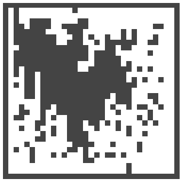

# Swarm Drone Optimization: 2D Coverage Platform

## Abstract

Multiple drones must cover a target region as effectively as possible while minimizing energy consumption. The objective is multi-criteria:

- maximize total area covered
- avoid covering the same area repeatedly
- minimize total energy usage
- avoid collisions with each other and with obstacles

This repository is a NumPy + matplotlib testbed for swarm-coverage control: continuous-action point-mass drones with speed/accel caps and an F450-calibrated battery model.

It has two halves: an **optimization** part that decides how drones move or split the area, and a **simulation** part that demonstrates and evaluates the behavior.
> Why 2D? It's a cheap **falsification** tool for the eventual Isaac Sim port. If an algorithm fails here, most likely it will fail in 3D simulation too.

---

## Prototype Drone

The simulator is calibrated to the actual hardware this project flies (**[Hawk's Work F450](https://www.hawks-work.com/pages/f450-drone)**) — a 1.3 kg quadcopter with a Pixhawk 2.4.8 flight controller, a 3S 4200 mAh LiPo, and a forward-facing STEEReoCAM Nano stereo camera.

Full hardware breakdown (per-component masses, camera geometry, hover times, cruise / range estimates, calibration sources) lives in [`docs/f450-reference.md`](docs/f450-reference.md). 3S/4S battery options for the F450 frame are in [`docs/battery-model.md`](docs/battery-model.md).

---

## Documentation

Detailed docs live in [`docs/`](docs/) — each focused on one topic:

| Doc | What's in it |
|---|---|
| [`docs/setup.md`](docs/setup.md) | Install, GUI deps for Linux/WSL, demo run modes, CLI flags, map editor, outputs layout. |
| [`docs/simulation-model.md`](docs/simulation-model.md) | World scale (5 m/cell), per-step flow contract, drone dynamics, coverage + visit-count metrics, intentional gaps to Isaac. |
| [`docs/battery-model.md`](docs/battery-model.md) | 3S/4S battery options, mass-aware hover power, voltage cutoff, calibration. |
| [`docs/f450-reference.md`](docs/f450-reference.md) | Hawk's Work F450 hardware spec, camera geometry|
| [`docs/verification.md`](docs/verification.md) | The three verification scripts (`test_overlap`, `test_flight_time`, `test_distance`) — what each asserts, how to run headless or `--gui`. |

---

## Test maps

All three tracks evaluate against the same three saved maps. Every map is **33×33 cells at 5 m/cell = 165 m × 165 m total** (27,225 m² with the 1-cell-thick boundary wall, 24,025 m² interior). They differ only in obstacle density:

|  |  |  |
|:---:|:---:|:---:|
| **`open_33`** | **`partial_33`** | **`closed_33`** |
| 88.2 % open | 73.0 % open | 53.1 % open |
| 24,025 m² free | 19,875 m² free | 14,450 m² free |

`tools/sweep.py` runs every controller on all three maps with 4 swarm sizes × 3 seeds, so each track's reported numbers cover the full (map × n_drones × seed) grid.

---

## Research tracks

Our group is exploring algorithm families in parallel, then converging on the most promising path:

| Track | Family | Owner | Status in this repo |
|---|---|---|---|
| 1 | Classical coverage and geometry-based methods (coverage path planning, grid decomposition, boustrophedon/lawnmower, Voronoi partitioning, task allocation) | Elen | Not synced yet |
| 2 | Metaheuristic optimization (PSO, Genetic Algorithms, Ant Colony, Simulated Annealing, Grey Wolf) | Raffi | **completed** |
| 3 | Learning and control-based methods (Potential Fields, Consensus-Based Coordination, Multi-Agent RL) | Armen | **completed** |

---

## Energy-aware objective

All methods — across all three tracks — must be evaluated against the same multi-criteria objective. For RL it's a reward; for Potential Fields and Consensus it's a cost / evaluation function.

Components:

- coverage percentage
- total distance traveled
- estimated energy consumption (see [`docs/battery-model.md`](docs/battery-model.md))
- overlap between drones
- collision count / proximity violations
- smoothness of movement
- time to complete coverage
- scalability as the number of drones grows

Keeping this objective **identical across 2D and Isaac** is the discipline that lets results transfer between environments.

---

## Quickstart

```bash
# First time (Linux/WSL — for GUI also: sudo apt install python3-tk python3-pil.imagetk)
python3 -m venv .optim_env
source .optim_env/bin/activate
pip install -r requirements.txt

# Run the demo
python tools/demo.py --gui --map maze --drones 4

# Verify the physics
python verification_scripts/test_overlap.py
python verification_scripts/test_flight_time.py
python verification_scripts/test_distance.py
```

Full setup details, GUI dependencies for Linux/WSL, and all flags are in [`docs/setup.md`](docs/setup.md).

---

## Results

### Track 1 — Classical / geometry-based

Five classical coverage algorithms implemented as **runtime controllers** matching the same `policy_fn(env) -> (n_drones, 3)` contract as Tracks 2 and 3. Each tuned by a 27-config grid search over its three most-impactful knobs — see `tools/grid_search_{boustrophedon,spiral,voronoi_partition,grid_decomposition,stc}.py`. Raw data and combined heatmaps in `outputs/csv_txt/` and `outputs/png/` respectively. The head-to-head sweep run via `tools/sweep_track1.py` writes `outputs/sweep_track1_results.csv` plus four plots in `outputs/sweep/{png,svg}/`.

Algorithms:
1. **Boustrophedon** (lawnmower) — partition map into vertical strips, drone *i* runs back-and-forth lanes inside its strip. Plan precomputed once, snap-to-free for waypoints that hit walls.
2. **Spiral** — each drone follows an outward Archimedean spiral (`r = pitch · θ / 2π`) from its initial position. No coordination.
3. **VoronoiPartition** — Voronoi-assign every free cell to the nearest drone start (one-time, frozen). Each drone heads to nearest uncovered cell *in its own region*. Static counterpart to Track 3's `Consensus` (which re-elects every step).
4. **GridDecomposition** — divide map into `block_size × block_size` rectangular blocks, assign each block to nearest drone start, drones visit blocks in nearest-first order.
5. **STC (Spanning Tree Coverage)** — Voronoi partition + BFS-ordered walk through every cell in the partition. Gabriely & Rimon, 2001.

**Final benchmark — coverage % by (map × n_drones), `tools/sweep_track1.py`, mean over 3 seeds:**

| Map | n | Random | Boustrophedon | Spiral | VoronoiPartition | GridDecomposition | STC |
|---|---|---|---|---|---|---|---|
| `open_33` | 2 | **94.8** | 32.3 | 10.5 | 90.4 | 40.1 | 92.8 |
| `open_33` | 5 | 99.8 | 46.2 | 26.3 | 98.5 | 90.8 | **100** |
| `open_33` | 10 | **100** | 91.3 | 89.0 | **100** | **100** | **100** |
| `open_33` | 20 | **100** | **100** | **100** | **100** | **100** | **100** |
| `partial_33` | 2 | **82.4** | 33.5 | 22.6 | 67.1 | 74.0 | 37.0 |
| `partial_33` | 5 | 98.2 | 87.8 | 44.6 | **98.6** | 91.6 | 84.3 |
| `partial_33` | 10 | **100** | **100** | 68.1 | 96.9 | 93.1 | 99.3 |
| `partial_33` | 20 | **100** | **100** | 89.2 | **100** | **100** | **100** |
| `closed_33` | 2 | **73.7** | 28.4 | 29.6 | 50.7 | 36.9 | 26.6 |
| `closed_33` | 5 | **94.6** | 36.2 | 61.1 | 81.1 | 79.5 | 76.9 |
| `closed_33` | 10 | **99.3** | 83.4 | 81.1 | 96.4 | 96.8 | 94.2 |
| `closed_33` | 20 | 99.9 | 97.1 | 94.2 | 99.5 | **100** | **100** |

**Best per algorithm** (from grid search, mean composite score across all 24 cells × 2 seeds):

| Algorithm | Best config | Score | Mean cov |
|---|---|---|---|
| **VoronoiPartition** | attract=1.0, repel_g=2.0, repel_r=4.0 | **+0.449** | 91.2% |
| **STC**              | attract=4.0, repel_g=10.0, repel_r=4.0 | +0.433 | 84.3% |
| **GridDecomposition** | block=8, attract=1.0, repel_g=5.0 | +0.382 | 85.2% |
| **Boustrophedon** | lane=2.5, attract=1.0, repel_g=2.0 | +0.157 | 69.5% |
| **Spiral** | pitch=4.0, attract=1.0, repel_g=10.0 | +0.065 | 60.5% |

**Headline findings:**
- **Random Gaussian is surprisingly competitive** — wins outright at most n=2 cells across all maps. The 33×33 maps are small enough that running to ALL_DEPLETED (~700 s) lets random walks cover most cells eventually. Random's "weakness" (no plan) is offset by the long sim horizon; what penalizes Random in the grid-search composite score is high overlap and energy use, not coverage.
- **VoronoiPartition is the strongest classical algorithm** — essentially the static counterpart of `ConsensusController` (Track 3). The dynamic re-election in Consensus only marginally helps over freezing the partition at *t=0*.
- **Plan-based algorithms (Boustrophedon, Spiral) struggle on dense maps** — precomputed paths assume a workable map shape; obstacles break the plan and the drone gets stuck.
- **GridDecomposition and STC sit in the middle** — Voronoi-flavored partition + structured traversal beats lawnmower/spiral but lags behind nearest-uncovered-in-region.

### Track 2 — Metaheuristic

All five population-/sample-based optimizers are implemented as **runtime controllers** matching the same `policy_fn(env) -> (n_drones, 3)` contract as Track 3. Each was tuned by a 27-config grid search across the full (map × n_drones × seed) sweep — see `tools/grid_search_{pso,ga,aco,sa,gwo}.py`. Track 2's frozen artifacts (grid CSVs, heatmaps, sweep results, sweep plots) live in `outputs_metaheuristic/`; the active `outputs/` is now Track 1's workspace.

Common framing: "the candidate solution" is a per-drone target cell (re-elected each step or evolved by the algorithm's update rule). Movement uses the same attract + drone/wall-repel + yaw-track-velocity stack as PF/Consensus.

**Final benchmark — coverage % by (map × n_drones), `tools/sweep_track2.py`, mean over 3 seeds:**

| Map | n | Random | PSO | GA | ACO | SA | GWO |
|---|---|---|---|---|---|---|---|
| `open_33` | 2 | 94.8 | 92.0 | **100** | 98.9 | **100** | **100** |
| `open_33` | 5 | 99.8 | 98.3 | **100** | **100** | **100** | **100** |
| `open_33` | 10 | **100** | **100** | **100** | **100** | **100** | **100** |
| `open_33` | 20 | **100** | **100** | **100** | **100** | **100** | **100** |
| `partial_33` | 2 | 82.4 | 89.6 | 87.0 | **99.5** | 63.0 | 88.0 |
| `partial_33` | 5 | 98.2 | **100** | 98.4 | 99.2 | 85.4 | 73.6 |
| `partial_33` | 10 | **100** | 99.9 | **100** | 98.1 | **100** | 99.3 |
| `partial_33` | 20 | **100** | **100** | **100** | **100** | **100** | 99.8 |
| `closed_33` | 2 | 73.7 | 42.0 | 66.6 | **75.8** | 35.5 | 35.9 |
| `closed_33` | 5 | 94.6 | 83.5 | **94.9** | 88.5 | 60.8 | 75.5 |
| `closed_33` | 10 | 99.3 | 95.7 | 99.2 | 96.2 | 96.2 | 47.6 |
| `closed_33` | 20 | 99.9 | 99.9 | **100** | **100** | **100** | 83.4 |

**Best per algorithm** (from grid search, mean composite score across all 24 cells × 2 seeds):

| Algorithm | Best config | Score | Mean cov |
|---|---|---|---|
| **ACO** | α=1.0, β=4.0, ρ=0.15 | **+0.470** | 96.0% |
| **PSO** | w=0.5, c1=3.0, c2=0.0 | +0.444 | 92.9% |
| **GA**  | elite=0.4, p_cx=0.10, p_mut=0.30 | +0.424 | 95.6% |
| **SA**  | T₀=0.5, α=0.999, σ=3.0 | +0.359 | 87.3% |
| **GWO** | a₀=5.0, a_f=0.5, decay=3000 | +0.251 | 84.4% |

**Cross-track findings:**
- **ACO and GA beat MARL at n=2** on open/partial maps — `ACO partial_33 n=2 = 99.5 %` vs `MARL = 90.4 %`. The simpler greedy-target approach with re-election each step actually outperforms a learned policy when each drone has lots of territory.
- **All Track 2 algorithms have a strong "information sharing hurts" pattern** — PSO's social pull, GA's crossover, GWO's leader-following all benefit from being turned *down* (or off entirely, like PSO `c2=0`). Drones doing their own thing wins on coverage problems.
- **SA and GWO are the weakest** — Metropolis "sometimes accept worse" and GWO's leader-flock dynamic produce wandering / herding that hurts spread.

#### Per-map breakdown (final coverage %, mean over 3 seeds)

##### `open_33` — 88.2 % open, 24,025 m² free


| Policy | n = 2 | n = 5 | n = 10 | n = 20 |
|---|---|---|---|---|
| **PSO** | 96.0 % | 97.2 % | 100.0 % | 100.0 % |
| **GA** | **100.0 %** | **100.0 %** | 100.0 % | 100.0 % |
| **ACO** | 98.9 % | **100.0 %** | 100.0 % | 100.0 % |
| **SA** | **100.0 %** | **100.0 %** | 100.0 % | 100.0 % |
| **GWO** | **100.0 %** | **100.0 %** | 100.0 % | 100.0 % |

##### `partial_33` — 73.0 % open, 19,875 m² free


| Policy | n = 2 | n = 5 | n = 10 | n = 20 |
|---|---|---|---|---|
| **PSO** | 94.4 % | 99.2 % | 100.0 % | 100.0 % |
| **GA** | 87.0 % | 98.4 % | 100.0 % | 100.0 % |
| **ACO** | **99.5 %** | 99.2 % | 98.1 % | 100.0 % |
| **SA** | 63.0 % | 85.4 % | 100.0 % | 100.0 % |
| **GWO** | 88.0 % | 73.6 % | 99.3 % | 99.8 % |

##### `closed_33` — 53.1 % open, 14,450 m² free (densest map)


| Policy | n = 2 | n = 5 | n = 10 | n = 20 |
|---|---|---|---|---|
| **PSO** | 51.5 % | 75.8 % | 90.2 % | 99.4 % |
| **GA** | 66.6 % | **94.9 %** | **99.2 %** | **100.0 %** |
| **ACO** | **75.8 %** | 88.5 % | 96.2 % | **100.0 %** |
| **SA** | 35.5 % | 60.8 % | 96.2 % | **100.0 %** |
| **GWO** | 35.9 % | 75.5 % | 47.6 % | 83.4 % |

#### Particle Swarm Optimization (PSO)

**Algorithm:** population-based stochastic search (Kennedy & Eberhart, 1995). Each "particle" is a candidate solution moving through the search space; its velocity is pulled by two attractors — its own personal-best position (cognitive term) and the swarm's global-best position (social term). Particles share information implicitly through the global best, so good regions get exploited collectively.

**Update rule (per iteration):**

```
v_{t+1} = w·v_t  +  c1·r1·(p_best − x_t)  +  c2·r2·(g_best − x_t)
x_{t+1} = x_t + v_{t+1}
```

with `r1, r2 ~ U(0, 1)` per dimension.

**Hyperparameters (canonical defaults):**

| Param | Typical value | Meaning |
|---|---|---|
| swarm size *N* | 20–50 | candidate solutions kept in parallel |
| inertia weight *w* | 0.7 | momentum on previous velocity |
| cognitive coefficient *c1* | 1.4 | weight on personal-best attraction |
| social coefficient *c2* | 1.4 | weight on global-best attraction |
| max iterations | problem-dependent | stop criterion |

#### Genetic Algorithm (GA)

**Algorithm:** evolutionary search (Holland, 1975; Goldberg, 1989). A population of "chromosomes" (encoded candidate solutions) evolves over generations through three operators: **selection** (favor higher-fitness chromosomes for reproduction), **crossover** (mix two parents to produce children), and **mutation** (random small perturbations that preserve diversity).

For coverage, a chromosome encodes either a per-drone waypoint sequence or a per-drone cell-assignment vector; fitness is the energy-aware objective evaluated by simulating the swarm in `CoverageEnv`.

**Hyperparameters (canonical defaults):**

| Param | Typical value | Meaning |
|---|---|---|
| population size | 50–200 | chromosomes per generation |
| crossover rate *p_c* | 0.6–0.9 | fraction of pairs that recombine |
| mutation rate *p_m* | 0.01–0.1 | per-gene perturbation probability |
| selection method | tournament (k=3) or roulette | how parents are chosen |
| elitism | top 1–5 % | best chromosomes survive untouched |
| generations | problem-dependent | stop criterion |

#### Ant Colony Optimization (ACO)

**Algorithm:** swarm intelligence inspired by ant pheromone trails (Dorigo, 1992; Dorigo & Stützle, 2004). Ants probabilistically construct solutions by walking the search graph; each move is biased by **pheromone strength** (deposited by past good solutions) and a **heuristic value** (problem-specific, e.g. distance to nearest uncovered cell). Pheromones evaporate over time so the colony can forget bad early choices.

**Probability of ant moving from i → j:**

```
P(i → j) = (τ_ij^α · η_ij^β) / Σ_k (τ_ik^α · η_ik^β)
```

where `τ` is pheromone strength and `η` is the heuristic value.

For coverage, ants walk grid cells (or waypoints); pheromones reinforce paths that yield high coverage with low overlap and energy.

**Hyperparameters (canonical defaults):**

| Param | Typical value | Meaning |
|---|---|---|
| number of ants *m* | 10–50 | parallel solution-builders per iteration |
| pheromone weight *α* | 1.0 | exploits past learning |
| heuristic weight *β* | 2–5 | exploits problem knowledge |
| evaporation rate *ρ* | 0.1–0.5 | per-iteration pheromone decay |
| pheromone deposit *Q* | 1.0 (often normalized) | scale of new pheromone laid by good solutions |
| max iterations | problem-dependent | stop criterion |

#### Simulated Annealing (SA)

**Algorithm:** single-solution stochastic search inspired by metallurgical annealing (Kirkpatrick, Gelatt, Vecchi, 1983). Starts from a candidate solution and at each step proposes a small perturbation. Better solutions are always accepted; **worse** solutions are accepted with probability `exp(−ΔE / T)` (the Metropolis criterion). The "temperature" *T* starts high (lots of exploration, escape from local optima) and decays over iterations until the search effectively becomes greedy.

**Hyperparameters (canonical defaults):**

| Param | Typical value | Meaning |
|---|---|---|
| initial temperature *T₀* | calibrated so initial accept rate ≈ 0.8 | controls early exploration |
| cooling schedule | geometric: `T_{k+1} = α·T_k`, α ≈ 0.95 | how T decays |
| final temperature *T_min* | 1e-3 · *T₀* | stop criterion |
| neighborhood operator | swap waypoints / perturb one drone's plan | defines local moves |
| iterations per temperature | 50–500 | how long to dwell at each *T* |

#### Grey Wolf Optimizer (GWO)

**Algorithm:** swarm intelligence based on the social hierarchy of grey wolf packs (Mirjalili, Mirjalili & Lewis, 2014). Wolves are ranked by fitness: the best three are α (alpha), β (beta), δ (delta); the rest are ω (omega). Each iteration, every wolf updates its position toward a weighted mean of α/β/δ — the leaders steer the pack. A control parameter *a* shrinks linearly from 2 → 0, transitioning from exploration (wolves can step *past* the leaders) to exploitation (they converge onto them).

**Hyperparameters (canonical defaults):**

| Param | Typical value | Meaning |
|---|---|---|
| pack size *N* | 20–40 | candidate solutions tracked |
| max iterations *T* | problem-dependent | stop criterion |
| control parameter *a* | linear 2 → 0 over *T* iterations | exploration/exploitation balance |
| coefficients *A*, *C* | derived from *a* and U(0,1) noise | per-iteration step magnitudes |

(GWO has notably few user-tunable knobs vs. PSO/GA — most behavior follows from the leader hierarchy and the *a* schedule.)

### Track 3 — Learning / control-based

1. **Potential Fields** — drones attracted to uncovered cells, repelled by obstacles, boundaries, and other drones. Simplest baseline; fast to implement and visualize. *Optimizes for:*
   - coverage progress (each drone heads to nearest uncovered cell)
   - inter-drone spacing (pairwise repel, 1/r²)
   - wall clearance (wall repel, 1/r²)
2. **Consensus-Based Coordination** — adds inter-drone rules / shared communication for spacing, formation, or task distribution. More coordinated than pure local reaction, but no learning. *Optimizes for:*
   - territorial coverage (each drone covers its own Voronoi region of uncovered cells)
   - inter-drone spacing (same repel as PF)
   - wall clearance (same repel as PF)
3. **Multi-Agent Reinforcement Learning** — drones learn policies through rewards that encode the energy-aware objective. Most powerful and most fragile (training cost, reward tuning, debugging). *PPO maximizes the discounted sum of per-step rewards over the episode*, where each step's reward = `(newly covered cells)  −  (small time penalty)  +  (completion bonus if 100% coverage reached)  −  (depletion penalty if all drones die first)  +  (optional shaping for overlap area, wasted visits, energy used)`.

**Final benchmark** — `tools/sweep.py` over the 3 maps (see [Test maps](#test-maps) above) × `n_drones ∈ {2, 5, 10, 20}` × 3 seeds = 144 runs. PF and Consensus use the `dense()` preset (random-search winner across all 7 knobs at n=5 `partial_33`, robustness confirmed by a refined random search). MARL uses the random-best PPO config (also from `tools/random_search_marl.py`) trained at 150k steps per swarm size with reward shaping.

Mean final coverage by swarm size (averaged over 3 maps × 3 seeds = 9 runs per cell):

| Policy | n = 2 | n = 5 | n = 10 | n = 20 |
|---|---|---|---|---|
| Random Gaussian   | 83.6 % | 97.5 % | 99.8 % | 99.9 % |
| **Potential Fields** | 46.1 % | 84.9 % | **99.3 %** | **100.0 %** |
| **Consensus**     | 48.5 % | 83.3 % | **99.7 %** | **100.0 %** |
| **MARL (PPO)**    | **85.8 %** | **94.5 %** | 98.3 % | **100.0 %** |

Key takeaways:
- **MARL dominates at sparse swarms (n = 2)** — `PFConfig.dense()` / `ConsensusConfig.dense()` use a wide repel range tuned for crowded swarms, which hurts when drones rarely meet (the trade-off documented in the dense-preset docstring).
- **All four policies converge to ≥ 99 % by n = 20** — at saturating swarm densities, the choice of policy matters less than the swarm size.

#### Per-map breakdown (final coverage %, mean over 3 seeds)

##### `open_33` — 88.2 % open, 24,025 m² free

| Policy | n = 2 | n = 5 | n = 10 | n = 20 |
|---|---|---|---|---|
| Random Gaussian   | 94.8 % | 99.8 % | 100.0 % | 100.0 % |
| **Potential Fields** | 11.8 % | 57.4 % | 100.0 % | 100.0 % |
| **Consensus**     | 11.8 % | 58.5 % | 100.0 % | 100.0 % |
| **MARL (PPO)**    | **93.4 %** | **99.0 %** | 99.3 % | 100.0 % |

##### `partial_33` — 73.0 % open, 19,875 m² free

| Policy | n = 2 | n = 5 | n = 10 | n = 20 |
|---|---|---|---|---|
| Random Gaussian   | 82.4 % | 98.2 % | 100.0 % | 100.0 % |
| **Potential Fields** | 78.9 % | **99.9 %** | 98.0 % | 100.0 % |
| **Consensus**     | 86.2 % | 98.8 % | 100.0 % | 100.0 % |
| **MARL (PPO)**    | **90.4 %** | 97.1 % | 98.2 % | 100.0 % |

##### `closed_33` — 53.1 % open, 14,450 m² free (densest map)

| Policy | n = 2 | n = 5 | n = 10 | n = 20 |
|---|---|---|---|---|
| Random Gaussian   | 73.7 % | 94.6 % | 99.3 % | 99.9 % |
| **Potential Fields** | 47.5 % | **97.3 %** | **99.8 %** | 100.0 % |
| **Consensus**     | 47.5 % | 92.6 % | 99.0 % | 100.0 % |
| **MARL (PPO)**    | **73.6 %** | 87.5 % | 97.3 % | 100.0 % |

---

## Cross-track comparison

All four Track 3 policies and all five Track 2 metaheuristics, evaluated on the same (map × n_drones) grid with their tuned defaults. **Bold** marks the per-cell winner. (Track 3 numbers from `outputs_control_based/csv_txt/sweep_results.csv`; Track 2 numbers from `outputs_metaheuristic/sweep_track2_results.csv`. Track 1 numbers in the Track 1 section above, from `outputs/sweep_track1_results.csv`.)

| Map | n | Random | PF | Consensus | MARL | ‖ | PSO | GA | ACO | SA | GWO |
|---|---|---|---|---|---|---|---|---|---|---|---|
| `open_33` | 2 | 94.8 | 11.8 | 11.8 | 93.4 | ‖ | 92.0 | **100** | 98.9 | **100** | **100** |
| `open_33` | 5 | 99.8 | 57.4 | 58.5 | 99.0 | ‖ | 98.3 | **100** | **100** | **100** | **100** |
| `open_33` | 10 | **100** | **100** | **100** | 99.3 | ‖ | **100** | **100** | **100** | **100** | **100** |
| `open_33` | 20 | **100** | **100** | **100** | **100** | ‖ | **100** | **100** | **100** | **100** | **100** |
| `partial_33` | 2 | 82.4 | 78.9 | 86.2 | 90.4 | ‖ | 89.6 | 87.0 | **99.5** | 63.0 | 88.0 |
| `partial_33` | 5 | 98.2 | **99.9** | 98.8 | 97.1 | ‖ | **100** | 98.4 | 99.2 | 85.4 | 73.6 |
| `partial_33` | 10 | **100** | 98.0 | **100** | 98.2 | ‖ | 99.9 | **100** | 98.1 | **100** | 99.3 |
| `partial_33` | 20 | **100** | **100** | **100** | **100** | ‖ | **100** | **100** | **100** | **100** | 99.8 |
| `closed_33` | 2 | 73.7 | 47.5 | 47.5 | 73.6 | ‖ | 42.0 | 66.6 | **75.8** | 35.5 | 35.9 |
| `closed_33` | 5 | 94.6 | **97.3** | 92.6 | 87.5 | ‖ | 83.5 | 94.9 | 88.5 | 60.8 | 75.5 |
| `closed_33` | 10 | 99.3 | **99.8** | 99.0 | 97.3 | ‖ | 95.7 | 99.2 | 96.2 | 96.2 | 47.6 |
| `closed_33` | 20 | 99.9 | **100** | **100** | **100** | ‖ | 99.9 | **100** | **100** | **100** | 83.4 |

**Headline cross-track findings:**

- **Track 2 metaheuristics dominate at sparse swarms (n = 2)** — `ACO partial_33 = 99.5 %` and `GA open_33 = 100 %` beat the best Track 3 policy at the same cell. The reason: with each drone re-electing its target every step, no learning is needed to handle the "lots of fresh territory" regime.
- **Track 3's PF/Consensus dominate at medium-to-large swarms on dense maps** — `closed_33 n=10` PF wins at 99.8 %, ahead of GA's 99.2 %. Force-field repulsion with PF/Consensus's tuned `dense()` preset handles crowding well.
- **MARL is the most robust on `closed_33` at low n** but is consistently beaten by greedy metaheuristics at low n on `open_33`/`partial_33`.
- **GWO and SA are the weakest** — leader-flock and Metropolis-wandering both produce coverage holes that don't close out. GWO collapses to 47.6 % on `closed_33 n=10`; SA drops to 35.5 % on `closed_33 n=2`.
- **Random Gaussian is a stronger baseline than expected** — at `closed_33 n=2` it beats all Track 2 metaheuristics (73.7 %) and ties MARL; at `open_33 n=2` it beats PF/Consensus by ~80 pp.

**Practical takeaway:** if I had to pick a single algorithm that's competitive across every operating point, **GA** has the most cells at 100 % and never falls below 66.6 %. **ACO** is the most balanced — strong everywhere and never collapses. PF/Consensus need their swarm-density preset chosen correctly; MARL is heaviest to deploy. Pick by deployment constraints.