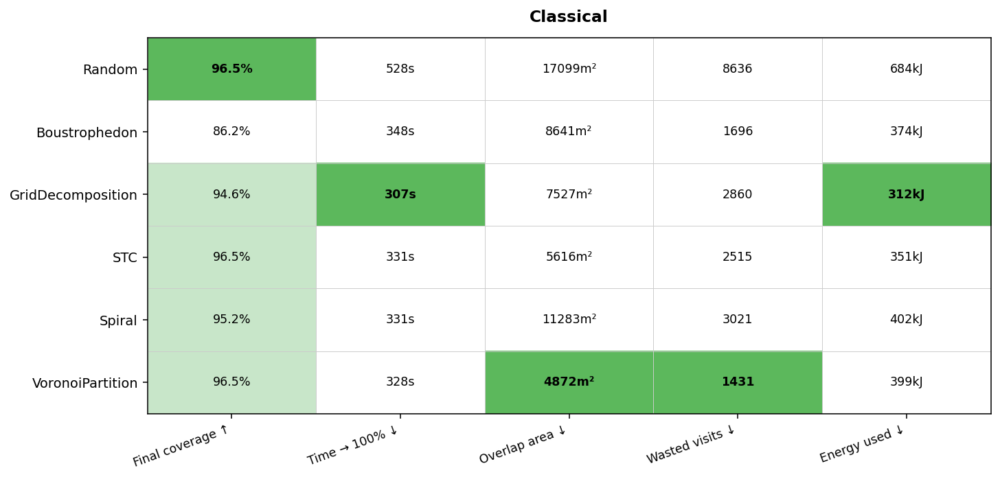
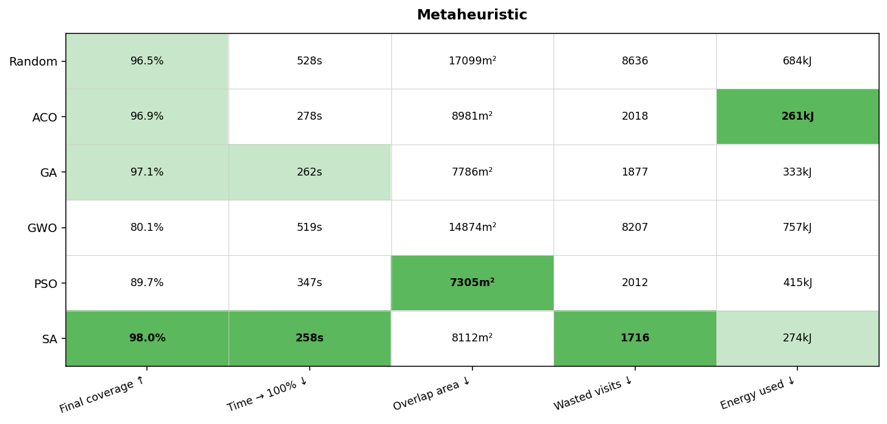
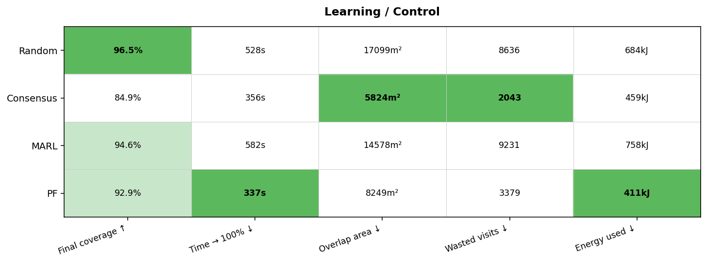
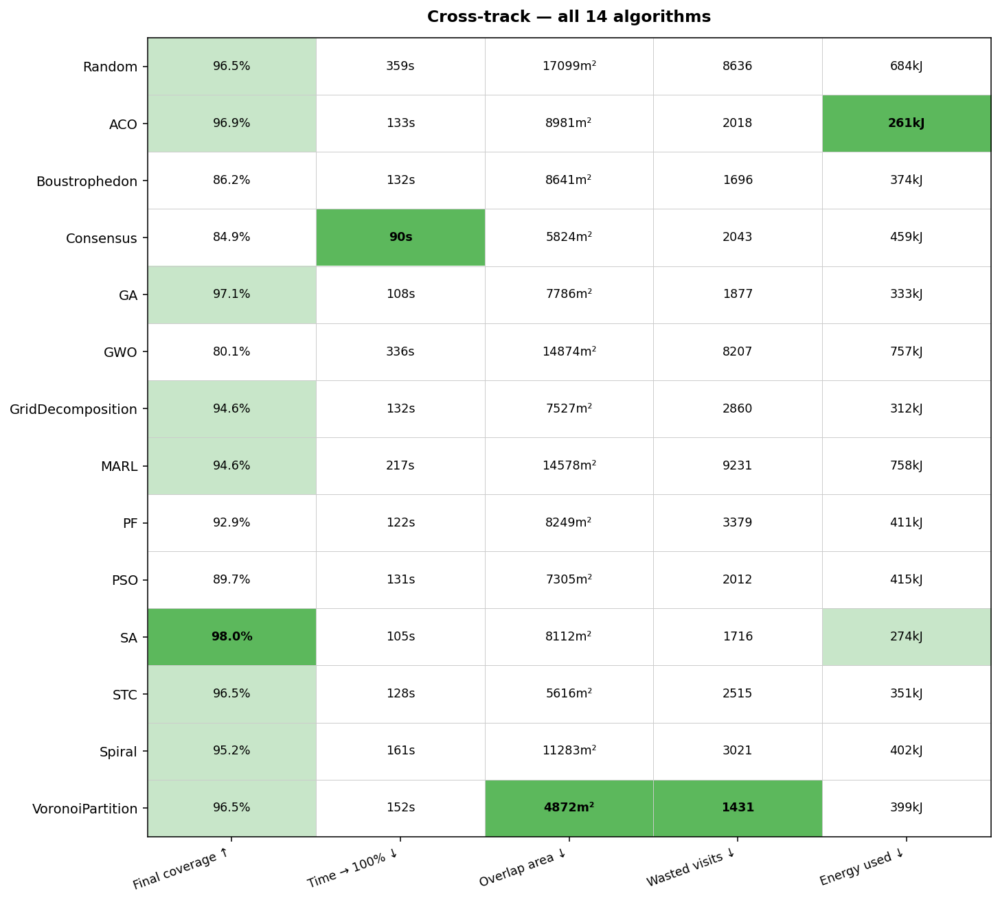

# Swarm Drone Optimization: 2D Coverage Platform

## Abstract

Multiple drones must cover a target region as effectively as possible while minimizing energy consumption. The objective is multi-criteria:

- maximize total area covered
- avoid covering the same area repeatedly
- minimize total energy usage
- avoid collisions with each other and with obstacles

This repository is a NumPy + matplotlib testbed for swarm-coverage control: continuous-action point-mass drones with speed/accel caps and an F450-calibrated battery model.

It has two halves: an **optimization** part that decides how drones move or split the area, and a **simulation** part that demonstrates and evaluates the behavior.
> Why 2D? It's a cheap **falsification** tool for the eventual Isaac Sim port. If an algorithm fails here, most likely it will fail in 3D simulation too.

---

## Prototype Drone

The simulator is calibrated to the actual hardware this project flies (**[Hawk's Work F450](https://www.hawks-work.com/pages/f450-drone)**) — a 1.3 kg quadcopter with a Pixhawk 2.4.8 flight controller, a 3S 4200 mAh LiPo, and a forward-facing STEEReoCAM Nano stereo camera.

Full hardware breakdown lives in [`docs/f450-reference.md`](docs/f450-reference.md). Battery options in [`docs/battery-model.md`](docs/battery-model.md).

---

## Documentation

| Doc | What's in it |
|---|---|
| [`docs/setup.md`](docs/setup.md) | Install, GUI deps, demo run modes, CLI flags, map editor, outputs layout. |
| [`docs/simulation-model.md`](docs/simulation-model.md) | World scale (5 m/cell), drone dynamics, coverage + visit-count metrics. |
| [`docs/battery-model.md`](docs/battery-model.md) | 3S/4S battery options, mass-aware hover power, voltage cutoff, calibration. |
| [`docs/f450-reference.md`](docs/f450-reference.md) | Hawk's Work F450 hardware spec, camera geometry. |

---

## Test maps

All three tracks evaluate against the same three saved maps. Every map is **33×33 cells at 5 m/cell = 165 m × 165 m**. They differ only in obstacle density:

|  |  |  |
|:---:|:---:|:---:|
| **`open_33`** | **`partial_33`** | **`closed_33`** |
| 88.2 % open | 73.0 % open | 53.1 % open |

---

## Evaluation protocol

Every algorithm is evaluated on the same fixed grid of **36 cells**:

| Axis | Values |
|---|---|
| Maps | `open_33`, `partial_33`, `closed_33` (3 maps) |
| Swarm sizes | 2, 5, 10, 20 drones (4 sizes) |
| Seeds | 3 independent runs per cell |
| **Total** | **3 × 4 × 3 = 36 runs per algorithm** |

Each reported metric (coverage %, energy, time, overlap, wasted visits) is the **mean across all 36 runs**. Non-completing runs are penalised at 1000 s on the time-to-100 % metric (above the 734 s physics-bounded simulation ceiling) so they rank below completing runs without collapsing rank-tie information.

Scripts: `tools/eval/eval_track1.py`, `eval_track2.py`, `eval_track3.py`. Leaderboard images and aggregated CSVs regenerated with `tools/leaderboard.py`.

---

## Research tracks

Three algorithm families were implemented and benchmarked, converging on the most promising approaches:

| Track | Family |
|---|---|
| 1 | Classical coverage and geometry-based methods (Boustrophedon, Spiral, VoronoiPartition, GridDecomposition, STC) |
| 2 | Metaheuristic optimization (PSO, Genetic Algorithms, Ant Colony, Simulated Annealing, Grey Wolf) |
| 3 | Learning and control-based methods (Potential Fields, Consensus-Based Coordination, Multi-Agent RL) |

---

## Energy-aware objective

All methods are evaluated against the same multi-criteria objective (reward for RL, cost function for the rest):

- coverage percentage
- total distance traveled / energy consumption (see [`docs/battery-model.md`](docs/battery-model.md))
- overlap between drones and wasted visits
- time to complete coverage
- scalability as the number of drones grows

Keeping this objective **identical across 2D and Isaac** is the discipline that lets results transfer between environments.

---

## Quickstart

```bash
# First time setup
python3 -m venv .optim_env
source .optim_env/bin/activate
pip install -r requirements.txt

# Run a demo (replace 'voronoi' with any policy flag below)
python3 tools/demo.py --gui --policy voronoi --drones 5 --map-file maps/open_33.npy --all-active --seed 1

# Verify the physics
python tools/verification/test_overlap.py
python tools/verification/test_flight_time.py
python tools/verification/test_distance.py
```

Each verification script has a headless mode (default — runs assertions, exits 0/1) and a `--gui` mode with a live animation. Add `--gui` to any of the commands above to see it visually.

| Script | What it proves |
|---|---|
| `test_overlap.py` | Visit-count metrics (`total_visits`, `self_revisits`, `cross_overlap_visits`, `wasted_visits_total`) against a deterministic 2-drone scripted scenario — 9 hand-computed assertions. |
| `test_flight_time.py` | Battery / energy model (`P_hover + k·v²`, voltage cutoff) agrees with the analytical formula to < 0.5 %. |
| `test_distance.py` | Tile scale (5 m/cell), motion integration, sensor wedge area, and range-to-cutoff are physically consistent with F450 derived dimensions. |

Policy flags: `boustrophedon`, `spiral`, `voronoi`, `grid_decomp`, `stc` (Track 1) · `pso`, `ga`, `aco`, `sa`, `gwo` (Track 2) · `pf`, `consensus`, `marl`, `random` (Track 3 + baseline).

Drop `--gui` for headless. Add `--save <tag>` to persist outputs instead of overwriting scratch files. Full flag reference in [`docs/setup.md`](docs/setup.md).

---

## Results

All algorithms tuned via **Bayesian Optimization** (`tools/tuning/bo_search.py`, Optuna TPE, 30 trials each). Full benchmark data in `outputs/*/sweep_track*_results.csv`; raw leaderboard tables in `outputs/leaderboards/leaderboards.md`.

### Track 1 — Classical

Boustrophedon · Spiral · VoronoiPartition · GridDecomposition · STC



**VoronoiPartition** wins overall — static partition + nearest-uncovered-in-region beats all other classical methods. Plan-based methods (Boustrophedon, Spiral) degrade on dense maps where precomputed paths hit walls they can't navigate around.

---

### Track 2 — Metaheuristic

PSO · GA · ACO · SA · GWO



**SA** wins — Metropolis exploration + tight perturbation radius after BO gives the best coverage at the lowest energy. "Information sharing hurts": PSO social pull, GA crossover, and GWO leader-following all BO-tuned down close to zero. GWO is the weakest — leader herding can't be rescued.

---

### Track 3 — Learning / control-based

Potential Fields · Consensus · MARL (PPO)



**MARL** wins the hardest cell (`closed_33 n=2`, 67.8 %) — the only method that learns wall-avoidance rather than computing it via explicit repulsion. **Consensus** is weakest overall; static VoronoiPartition (Track 1) outperforms it at 96.5 % vs 84.9 % mean coverage.

---

## Cross-track comparison

Top-1 from each track + Random baseline, evaluated on the same grid:



**SA** (Track 2) is the overall winner — highest coverage, fastest time-to-100, lowest energy. **VoronoiPartition** (Track 1) leads on overlap and wasted visits. **MARL** (Track 3) is the only method that generalises beyond explicit force-field rules and wins on the hardest map × swarm-size cell.
